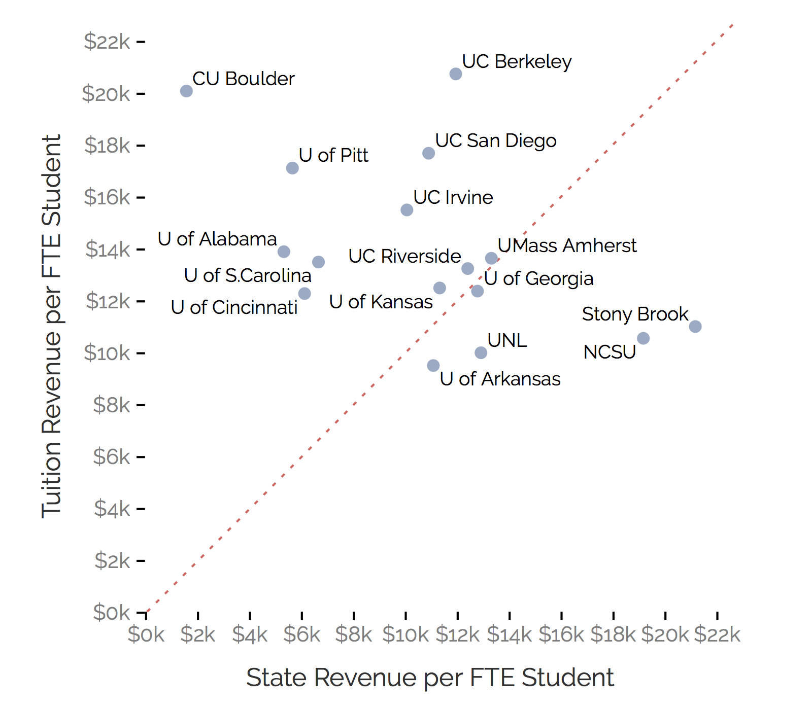

# Motivation
## Why study recruiting

The problem: access to public research universities
- Historical mission of social mobility for meritorious state residents
- Concern about growing socioeconomic and racial inequality in access
 
Mainstream policy discourse about access: The 2014 White House "Access Summit" 
- The White House (2014) review of causes of unequal college access
    - "achievement gap", "under-matching"; place responsibility on students, K-12 schools
    - affordability; declining state support leads to rising tuition prices
- The White House (2014) asks universities for *Commitments to Action on College Opportunity*
    - Universities pledge "action plans" (e.g., need-based financial aid, "outreach", holistic admission)

 
Problem with policy discourse: does not interrogate university enrollment priorities
- Applauds universities for commitment to access despite "deficiencies" of students and K-12 schools, despite declines in state funding
- Decades of research finds policy adoption a symbolic effort to appease stakeholders (e.g., Davis, 2005)

--- 

# Motivation
## Why study recruiting

Alternative explanation for access inequality
- University enrollment priorities biased against poor students and/or communities of color

Why study university recruiting behavior
- Universities expend substantial resources identifying and recruiting prospects (Ruffalo Noel-Levitz, 2018)
- Internal resource allocation better indicator of organizational priorities than rhetoric, policies
- Knowing which student populations targeted by recruiting efforts indicates enrollment priorities

Research focus
- Analyze off-campus recruiting visits (e.g., visit to a local high school) by public research universities as a means of gaining insight about university enrollment priorities
- **Research question**
    - What are the similarities and differences in off-campus recruiting patterns across universities?
- **Analytic focus**
    - Income; race; academic achievement; in-state vs. out-of-state

--- &twocol

# Motivation
## The enrollment funnel

*** =left

**The enrollment funnel**

*** =right

**Interventions along the funnel**
* Identify prospects
    - Buy "student lists" from College Board/ACT
* Recruit prospects remotely
    * Email, mail, text, etc.
* Recruit prospects in-person
    * **Off-campus recruiting visits** (e.g., high school visits, college fairs)
    * Campus visits
    * Other "outreach"
* Solicit inquiries, stealth applicants
    * Social media, advertising
* Convert admits to enrollees
    * Financial aid leveraging

--- 

# Conceptual Framing
## The sieve and the market

<!--
functions of higher education: "sieve," "incubator," "temple," and "hub"
-->

The "sieve" function of higher education (Stevens, Armstrong, and Arum, 2008)
- Higher education allocates people to different occupational/social positions
- Dual character of education [CITE WEBER], simultaneously serves
    - Social mobility: redistributing access to privileged positions
    - Social reproduction: privileged families get access to universities that confer the best positions
    
 
Political economy of US higher education citep(bib['RN4517'])`:
- "National service" configuration
    - Expansion of federal and state investment in higher ed
    - Creation of state higher education systems
- "Market" configuration
    - Demographic contraction; state disinvestment
    - Transportation, technology advances, national guidebooks and rankings create national market

 
Under "national service," the sieve serves redistribution. Under "market," sieve serves reproduction

--- 

# Conceptual Framing
## The political economy of enrollment management

la la 

--- 

# Empirical context
## Causes and consequences of nonresident enrollment growth

--- 

# Empirical context
## State funding and tuition revenue

</img>

--- 

# Research overview
## Off-campus recruiting visits by public research universities

<!--
overview of the project, data collection, etc

Add links to other/more detailed presentations/publications
-->

---

# Data and Methods
## Summary of Data Collection Sources and Quality Checks Performed

  

<table class="appendix-table">         <thead>             <tr>             <th class="blank"></th>     <th class="bold">NC State</th> <th class="bold">Rutgers</th> <th class="bold">Stony Brook</th> <th class="bold">Alabama</th> <th class="bold">Arkansas</th> <th class="bold">UC Berkeley</th> <th class="bold">UC Irvine</th> <th class="bold">UC Riverside</th> <th class="bold">UC San Diego</th> <th class="bold">Cincinnati</th> <th class="bold">CU Boulder</th> <th class="bold">Georgia</th> <th class="bold">Kansas</th> <th class="bold">UMass</th> <th class="bold">Nebraska</th> <th class="bold">Pittsburgh</th> <th class="bold">S.Carolina</th>              </tr>         </thead>         <tbody>     <tr><td class="blank bold">Web-scrape data collection</td><td class="blank"></td><td class="blank"></td><td class="blank"></td><td class="blank"></td><td class="blank"></td><td class="blank"></td><td class="blank"></td><td class="blank"></td><td class="blank"></td><td class="blank"></td><td class="blank"></td><td class="blank"></td><td class="blank"></td><td class="blank"></td><td class="blank"></td><td class="blank"></td><td class="blank"></td></tr> <tr><td class="indent">Scraped data on off-campus recruiting events?</td><td>Y</td><td>Y</td><td>Y</td><td>Y</td><td>Y</td><td>Y</td><td>Y</td><td>Y</td><td>Y</td><td>Y</td><td>Y</td><td>Y</td><td>Y</td><td>Y</td><td>Y</td><td>Y</td><td>Y</td></tr> <tr><td class="indent">Manually checked each scraped event?</td><td>Y</td><td>Y</td><td>Y</td><td>Y</td><td>Y</td><td>Y</td><td>Y</td><td>Y</td><td>Y</td><td>Y</td><td>Y</td><td>Y</td><td>Y</td><td>Y</td><td>Y</td><td>Y</td><td>Y</td></tr> <tr><td class="blank"></td><td class="blank"></td><td class="blank"></td><td class="blank"></td><td class="blank"></td><td class="blank"></td><td class="blank"></td><td class="blank"></td><td class="blank"></td><td class="blank"></td><td class="blank"></td><td class="blank"></td><td class="blank"></td><td class="blank"></td><td class="blank"></td><td class="blank"></td><td class="blank"></td><td class="blank"></td></tr> <tr><td class="blank bold">Public records request data collection</td><td class="blank"></td><td class="blank"></td><td class="blank"></td><td class="blank"></td><td class="blank"></td><td class="blank"></td><td class="blank"></td><td class="blank"></td><td class="blank"></td><td class="blank"></td><td class="blank"></td><td class="blank"></td><td class="blank"></td><td class="blank"></td><td class="blank"></td><td class="blank"></td><td class="blank"></td></tr> <tr><td class="indent">Requested data from Enrollment Management VP from university?</td><td>Y</td><td>Y</td><td>Y</td><td>Y</td><td>Y</td><td>Y</td><td>Y</td><td>Y</td><td>Y</td><td>Y</td><td>Y</td><td>Y</td><td>Y</td><td>Y</td><td>Y</td><td>Y</td><td>Y</td></tr> <tr><td class="indent">Received data from Enrollment Management VP?</td><td>N</td><td>N</td><td>N</td><td>N</td><td>N</td><td>N</td><td>N</td><td>Y</td><td>N</td><td>N</td><td>N</td><td>Y</td><td>N</td><td>N</td><td>N</td><td>N</td><td>N</td></tr> <tr><td class="blank"></td><td class="blank"></td><td class="blank"></td><td class="blank"></td><td class="blank"></td><td class="blank"></td><td class="blank"></td><td class="blank"></td><td class="blank"></td><td class="blank"></td><td class="blank"></td><td class="blank"></td><td class="blank"></td><td class="blank"></td><td class="blank"></td><td class="blank"></td><td class="blank"></td><td class="blank"></td></tr> <tr><td class="indent">State law allows nonresidents to request from public universities?</td><td>Y</td><td>N</td><td>Y</td><td>Ambiguous</td><td>N</td><td>Y</td><td>Y</td><td>Y</td><td>Y</td><td>Y</td><td>Y</td><td>N</td><td>Y</td><td>Y</td><td>Y</td><td>N</td><td>Y</td></tr> <tr><td class="indent">Made public records request to university?</td><td>Y</td><td>Y</td><td>Y</td><td>Y</td><td>Y</td><td>Y</td><td>Y</td><td>N</td><td>Y</td><td>Y</td><td>Y</td><td>N</td><td>Y</td><td>Y</td><td>Y</td><td>Y</td><td>Y</td></tr> <tr><td class="indent">Received public records data from university (by 10/1/2019)?</td><td>Y</td><td>Y</td><td>Y</td><td>N</td><td>N</td><td>Y</td><td>Y</td><td>-</td><td>Y</td><td>Y</td><td>Y</td><td>-</td><td>Y</td><td>Y</td><td>N</td><td>N</td><td>Y</td></tr> <tr><td class="blank"></td><td class="blank"></td><td class="blank"></td><td class="blank"></td><td class="blank"></td><td class="blank"></td><td class="blank"></td><td class="blank"></td><td class="blank"></td><td class="blank"></td><td class="blank"></td><td class="blank"></td><td class="blank"></td><td class="blank"></td><td class="blank"></td><td class="blank"></td><td class="blank"></td><td class="blank"></td></tr> <tr><td class="indent">Manually checked each visit from requested data?</td><td>N</td><td>Y</td><td>Y</td><td>-</td><td>-</td><td>Y</td><td>Y</td><td>Y</td><td>Y</td><td>Y</td><td>Y</td><td>Y</td><td>Y</td><td>Y</td><td>-</td><td>-</td><td>Y</td></tr> <tr><td class="blank"></td><td class="blank"></td><td class="blank"></td><td class="blank"></td><td class="blank"></td><td class="blank"></td><td class="blank"></td><td class="blank"></td><td class="blank"></td><td class="blank"></td><td class="blank"></td><td class="blank"></td><td class="blank"></td><td class="blank"></td><td class="blank"></td><td class="blank"></td><td class="blank"></td><td class="blank"></td></tr> <tr><td class="blank bold">Data used in report analyses</td><td class="blank"></td><td class="blank"></td><td class="blank"></td><td class="blank"></td><td class="blank"></td><td class="blank"></td><td class="blank"></td><td class="blank"></td><td class="blank"></td><td class="blank"></td><td class="blank"></td><td class="blank"></td><td class="blank"></td><td class="blank"></td><td class="blank"></td><td class="blank"></td><td class="blank"></td></tr> <tr><td class="indent">Web-scrape data is primary data source?</td><td>Y</td><td>N</td><td>N</td><td>Y</td><td>Y</td><td>N</td><td>N</td><td>N</td><td>N</td><td>N</td><td>N</td><td>N</td><td>N</td><td>N</td><td>Y</td><td>Y</td><td>N</td></tr> <tr><td class="indent">Public records data used as primary data source?</td><td class="col-width">N</td><td class="col-width">Y</td><td class="col-width">Y</td><td class="col-width">N</td><td class="col-width">N</td><td class="col-width">Y</td><td class="col-width">Y</td><td class="col-width">Y</td><td class="col-width">Y</td><td class="col-width">Y</td><td class="col-width">Y</td><td class="col-width">Y</td><td class="col-width">Y</td><td class="col-width">Y</td><td class="col-width">N</td><td class="col-width">N</td><td class="col-width">Y</td></tr>          </tbody>     </table>
  

--- &vertical

# Off-Campus Recruiting Results
## Within-case results

**N** refers to total number of off-campus recruiting visits

<!--
select mu.univ_id, muc.univ_name, muc.univ_abbrev, mu.state_code, sd.state_name, muc.metro1, msa1.cbsa_title as metro1_name, muc.metro2, msa2.cbsa_title as metro2_name, muc.metro3, msa3.cbsa_title as metro3_name, (
  select count(*)
  from parsing p
  left join parsing_visiting_univs pvu on pvu.pid = p.pid
  left join univ_canon uc on uc.univ_id = pvu.univ_id and uc.pid = pvu.pid
  left join location_matches lm on lm.pid = p.pid and lm.id_type = 'ncessch'
  left join location_matches lm2 on lm2.pid = p.pid and lm2.id_type = 'ipeds'
  left join meta_high_school_public mpub on mpub.ncessch = lm.location_id
  left join meta_high_school_private mpri on mpri.ncessch = lm.location_id
  left join meta_university imu on imu.univ_id = lm2.location_id
  where pvu.univ_id = if(mu.univ_id not in ('196097', '186380', '201885', '139959', '110635', '110653', '110671', '110680', '166629', '126614', '155317', '218663'), mu.univ_id, concat(mu.univ_id, '_req'))
  and event_country = 'US'
  and event_date between '2017-01-01' and '2017-12-31'
  and uc.univ_canonical_pid is null
  and p.include = 1
  and (mpub.ncessch is null or mpub.include_school = 1)
  and (mpri.ncessch is null or mpri.include_school = 1)
  and (lm.location_id is null or lm.location_id != 'indy')
  and (imu.univ_id is null or imu.univ_id != mu.univ_id)
  and coalesce(p.`event_state`, mpub.`state_code`, mpri.`state_code`, imu.`state_code`) is not null
) as count
from meta_university mu
left join state_data sd on sd.state_code = mu.state_code
left join meta_univ_classification muc on muc.univ_id = mu.univ_id
left join msa_metadata msa1 on msa1.cbsa_code = muc.metro1
left join msa_metadata msa2 on msa2.cbsa_code = muc.metro2
left join msa_metadata msa3 on msa3.cbsa_code = muc.metro3
where mu.univ_id in ('100751', '106397', '110635', '110653', '110671', '110680', '126614', '139959', '155317', '166629', '181464', '186380', '196097', '199193', '201885', '215293', '218663')
order by 2;
-->

<ul id="univ_options">
<li><a data-univ-id="199193" data-univ-name="North Carolina State University" data-state-name="North Carolina" data-metro1-name="Raleigh, NC" data-metro2-name="New York-Newark-Jersey City, NY-NJ-PA" data-metro3-name="Washington-Arlington-Alexandria, DC-VA-MD-WV">North Carolina State University</a> (N=371)</li><li><a data-univ-id="186380" data-univ-name="Rutgers University-New Brunswick" data-state-name="New Jersey" data-metro1-name="New York-Newark-Jersey City, NY-NJ-PA" data-metro2-name="Washington-Arlington-Alexandria, DC-VA-MD-WV" data-metro3-name="San Francisco-Oakland-Hayward, CA">Rutgers University-New Brunswick</a> (N=1,623)</li><li><a data-univ-id="196097" data-univ-name="Stony Brook University" data-state-name="New York" data-metro1-name="New York-Newark-Jersey City, NY-NJ-PA" data-metro2-name="Hartford-West Hartford-East Hartford, CT" data-metro3-name="Philadelphia-Camden-Wilmington, PA-NJ-DE-MD">Stony Brook University</a> (N=1,081)</li><li><a data-univ-id="100751" data-univ-name="University of Alabama" data-state-name="Alabama" data-metro1-name="Birmingham-Hoover, AL" data-metro2-name="Atlanta-Sandy Springs-Roswell, GA" data-metro3-name="Dallas-Fort Worth-Arlington, TX">University of Alabama</a> (N=4,282)</li><li><a data-univ-id="106397" data-univ-name="University of Arkansas" data-state-name="Arkansas" data-metro1-name="Fayetteville-Springdale-Rogers, AR-MO" data-metro2-name="Dallas-Fort Worth-Arlington, TX" data-metro3-name="Chicago-Naperville-Elgin, IL-IN-WI">University of Arkansas</a> (N=1,013)</li><li><a data-univ-id="110635" data-univ-name="University of California-Berkeley" data-state-name="California" data-metro1-name="San Francisco-Oakland-Hayward, CA" data-metro2-name="Washington-Arlington-Alexandria, DC-VA-MD-WV" data-metro3-name="Atlanta-Sandy Springs-Roswell, GA">University of California-Berkeley</a> (N=1,126)</li><li><a data-univ-id="110653" data-univ-name="University of California-Irvine" data-state-name="California" data-metro1-name="Los Angeles-Long Beach-Anaheim, CA" data-metro2-name="Seattle-Tacoma-Bellevue, WA" data-metro3-name="Urban Honolulu, HI">University of California-Irvine</a> (N=939)</li><li><a data-univ-id="110671" data-univ-name="University of California-Riverside" data-state-name="California" data-metro1-name="Riverside-San Bernardino-Ontario, CA" data-metro2-name="Seattle-Tacoma-Bellevue, WA" data-metro3-name="Houston-The Woodlands-Sugar Land, TX">University of California-Riverside</a> (N=1,066)</li><li><a data-univ-id="110680" data-univ-name="University of California-San Diego" data-state-name="California" data-metro1-name="San Diego-Carlsbad, CA" data-metro2-name="New York-Newark-Jersey City, NY-NJ-PA" data-metro3-name="Washington-Arlington-Alexandria, DC-VA-MD-WV">University of California-San Diego</a> (N=1,331)</li><li><a data-univ-id="201885" data-univ-name="University of Cincinnati" data-state-name="Ohio" data-metro1-name="Cincinnati, OH-KY-IN" data-metro2-name="Chicago-Naperville-Elgin, IL-IN-WI" data-metro3-name="Washington-Arlington-Alexandria, DC-VA-MD-WV">University of Cincinnati</a> (N=1,369)</li><li><a data-univ-id="126614" data-univ-name="University of Colorado-Boulder" data-state-name="Colorado" data-metro1-name="Denver-Aurora-Lakewood, CO" data-metro2-name="Los Angeles-Long Beach-Anaheim, CA" data-metro3-name="Chicago-Naperville-Elgin, IL-IN-WI">University of Colorado-Boulder</a> (N=1,546)</li><li><a data-univ-id="139959" data-univ-name="University of Georgia" data-state-name="Georgia" data-metro1-name="Atlanta-Sandy Springs-Roswell, GA" data-metro2-name="Los Angeles-Long Beach-Anaheim, CA" data-metro3-name="Dallas-Fort Worth-Arlington, TX">University of Georgia</a> (N=885)</li><li><a data-univ-id="155317" data-univ-name="University of Kansas" data-state-name="Kansas" data-metro1-name="Kansas City, MO-KS" data-metro2-name="Chicago-Naperville-Elgin, IL-IN-WI" data-metro3-name="St. Louis, MO-IL">University of Kansas</a> (N=1,419)</li><li><a data-univ-id="166629" data-univ-name="University of Massachusetts-Amherst" data-state-name="Massachusetts" data-metro1-name="Boston-Cambridge-Newton, MA-NH" data-metro2-name="New York-Newark-Jersey City, NY-NJ-PA" data-metro3-name="Los Angeles-Long Beach-Anaheim, CA">University of Massachusetts-Amherst</a> (N=1,137)</li><li><a data-univ-id="181464" data-univ-name="University of Nebraska-Lincoln" data-state-name="Nebraska" data-metro1-name="Lincoln, NE" data-metro2-name="Chicago-Naperville-Elgin, IL-IN-WI" data-metro3-name="Dallas-Fort Worth-Arlington, TX">University of Nebraska-Lincoln</a> (N=1,421)</li><li><a data-univ-id="215293" data-univ-name="University of Pittsburgh" data-state-name="Pennsylvania" data-metro1-name="Pittsburgh, PA" data-metro2-name="Chicago-Naperville-Elgin, IL-IN-WI" data-metro3-name="Washington-Arlington-Alexandria, DC-VA-MD-WV">University of Pittsburgh</a> (N=1,233)</li><li><a data-univ-id="218663" data-univ-name="University of South Carolina-Columbia" data-state-name="South Carolina" data-metro1-name="Columbia, SC" data-metro2-name="New York-Newark-Jersey City, NY-NJ-PA" data-metro3-name="Chicago-Naperville-Elgin, IL-IN-WI">University of South Carolina-Columbia</a> (N=2,144)</li>
</ul>

*** #toc

# Table of Contents
## &nbsp;

  <ul>
    <li><a href="#/11/2">National Overview</a></li>
    <li>In-State Results
      <ul>
        <li><a href="#/11/3">State (Map)</a></li>
        <li><a href="#/11/4">State (Figures)</a></li>
        <li><a href="#/11/5">Metro (Map)</a></li>
        <li><a href="#/11/6">Metro (Figures)</a></li>
      </ul>
    </li>
    <li>Out-of-State Results
      <ul>
        <li><a href="#/11/7">Top Visited Metro Areas</a></li>
        <li><a href="#/11/8">Out-of-State (Figures)</a></li>
        <li><a href="#/11/9">Metro 1 (Map)</a></li>
        <li><a href="#/11/10">Metro 1 (Figures)</a></li>
        <li><a href="#/11/11">Metro 2 (Map)</a></li>
        <li><a href="#/11/12">Metro 2 (Figures)</a></li>
      </ul>
    </li>
  </ul>

***

# National Overview
## &nbsp;

  

    
    
  

  

    
    
  

***

# In-State Results
## State Map

<iframe id="map-state-in" width=100% height=100% allowtransparency="true"></iframe>

***

# In-State Results
## State Figures

  

    
    
    
  

  

    
    
    
  

***

# In-State Results
## Metro Area Map

<iframe id="map-metro-in" width=100% height=100% allowtransparency="true"></iframe>

***

# In-State Results
## Metro Area Figures

  

    
    
    
  

  

    
    
    
  

***

# Out-of-State Results
## Top Visited Metro Areas

  <table id="table-metro-count"></table>

***

# Out-of-State Results
## &nbsp;

  

    
    
  

  

    
    
  

***

# Out-of-State Results
## Metro Area Map

<iframe id="map-metro-out-1" width=100% height=100% allowtransparency="true"></iframe>

***

# Out-of-State Results
## Metro Area Figures

  

    
    
    
  

  

    
    
    
  

***

# Out-of-State Results
## Metro Area Map

<iframe id="map-metro-out-2" width=100% height=100% allowtransparency="true"></iframe>

***

# Out-of-State Results
## Metro Area Figures

  

    
    
    
  

  

    
    
    
  

---

# Off-Campus Recruiting Results
## Number of events by type and in-state, out-of-state

  <iframe src="./assets/graphs/visit_count_combo.html" width='100%'></iframe>

---

# Off-Campus Recruiting Results
## Average median household income of visited vs. non-visited public high schools

  <iframe src="./assets/graphs/third_way_income.html" width='100%'></iframe>

---

# Off-Campus Recruiting Results
## Average racial composition of visited vs. non-visited high schools

  <iframe src="./assets/graphs/third_way_race.html" width='100%'></iframe>

---

# Discussion
## A theory of change

---

# Discussion
## This is what happens when government disinvests in public universities

--- #references

# References
## &nbsp;

<a href="#cite-RN2436">[1]</a><cite>
G. F. Davis.
&ldquo;Firms and environments&rdquo;.
In: 
<em>The handbook of economic sociology</em>.
Ed. by N. J. Smelser and R. Swedberg.
New York: Russell Sage Foundation, 2005, pp. 478-502.
ISBN: 0691034486 (alk. paper).</cite>

<a href="#cite-RN4402">[2]</a><cite>
Ruffalo Noel-Levitz.
<em>2018 marketing and student recruitment report of effective practices</em>.
Tech. rep.
Ruffalo Noel-Levitz, 2018.
URL: <a href="http://learn.ruffalonl.com/rs/395-EOG-977/images/RNL_2018_Student_Recruitment_Marketing_Report_EM-19.pdf">http://learn.ruffalonl.com/rs/395-EOG-977/images/RNL_2018_Student_Recruitment_Marketing_Report_EM-19.pdf</a>.</cite>

<a href="#cite-RN4017">[3]</a><cite>
The White House.
<em>Commitments to action on college opportunity</em>.
Tech. rep.
The Executive Office of the President, 2014.</cite>

<a href="#cite-RN4016">[4]</a><cite>
The White House.
<em>Increasing college opportunity for low-income students</em>.
Tech. rep.
The Executive Office of the President, 2014.</cite>

